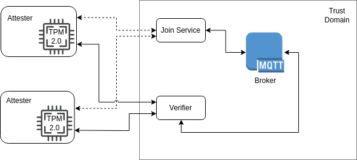

Overview
========

    
    System Architecture

The system has the purpose to provide integrity verification throught a dynamic framework constrained-devices oriented.
It is designed to support dynamism for *Attesters* joining to the framework.

For this reason, a *Join protocol* (:ref:`attester-join`) has been defined to support eventually external devices, not owned by the framework propietary.